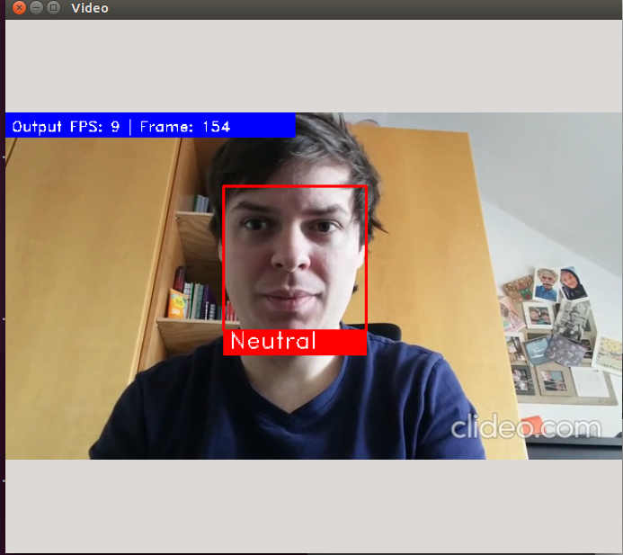

# Project-Template for IWS 276 Labor

Short introduction to project assigment.

<p align="center">
  
  Link to Demo Video
</p>

> This work was done by Daahir Ali, Louis Tschall, Konstantin Krause during the IWI276 Autonome Systeme Labor at the Karlsruhe University of Applied Sciences (Hochschule Karlsruhe - Technik und Wirtschaft) in SS 2020. 

## Table of Contents

- [Project-Template for IWS 276 Labor](#project-template-for-iws-276-labor)
  - [Table of Contents](#table-of-contents)
  - [Requirements](#requirements)
  - [Prerequisites](#prerequisites)
  - [Pre-trained models](#pre-trained-models)
  - [Running](#running)
  - [Acknowledgments](#acknowledgments)
  - [Contact](#contact)

## Requirements
* Python 3.6 (or above)
* OpenCV 4.0 (or above)
* Jetson Nano
* Jetpack 4.2
> [Optional] ...

## Prerequisites
1. Install requirements:
Installation in virtual environment:
   - Pytorch
       ```
       wget https://nvidia.box.com/shared/static/3ibazbiwtkl181n95n9em3wtrca7tdzp.whl -O torch-1.5.0-cp36-cp36m-linux_aarch64.whl
       sudo apt-get install python3-pip libopenblas-base
       pip install Cython
       pip install numpy torch-1.4.0-cp36-cp36m-linux_aarch64.whl
       ```
   - Torchvision
       ```
       sudo apt-get install libjpeg-dev zlib1g-dev
       git clone --branch v0.6.0 https://github.com/pytorch/vision torchvision
       cd torchvision
       sudo python setup.py install
       cd ../
       ```
   - torch2trt
       Follow manual on https://github.com/NVIDIA-AI-IOT/torch2trt#setup
   - Face_Recognition (https://github.com/ageitgey/face_recognition)
       ```
       pip install face_recognition
       ```
2. Convert pretrained model
  - Conversion
    ```
    python convert2trt.py <mode> <source> <target>
    ```
   - Info: the pipeline expects the converted model to be located under `'./models/resnet50.224.trt.pth'`. If needed this has to be changed in  `face_expression_recognition.py`.

## Pre-trained models

Pre-trained model is available at pretrained-models.
The converteed pretrained model has to be unzipped using 7-Zip, because of GitHub's 100mb upload limit
This can be done with `7z x archive.7z.001`
The converted pretrained model `resnet50.224.trt.pth` may or may not work on your machine bunt in any case a self-converted model is signtificantly faster than this one.

## Running

The pipeline can be run with
```bash
python pipeline_main.py <source>
```
Available sources are for example:
- Camera-Index (e.g. 0)
- IP-Camera (als URL)
- Video (PfPathad, e.g. mp4)

In file `config.yml` are settings to improve performance or accuracy. 

## Acknowledgments

This repo is based on
  - [Face Detection, Recognition and Emotion Detection in 8 lines of code!](https://towardsdatascience.com/face-detection-recognition-and-emotion-detection-in-8-lines-of-code-b2ce32d4d5de)
  - [torch2trt](https://github.com/NVIDIA-AI-IOT/torch2trt)
  - [Face Recognition](https://github.com/ageitgey/face_recognition)

Thanks to the original authors for their work!

## Contact
Please email `mickael.cormier AT iosb.fraunhofer.de` or `tschalllouis` AT-Sign `gmail.com` for further questions.
